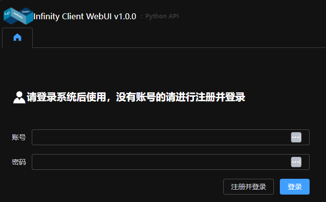
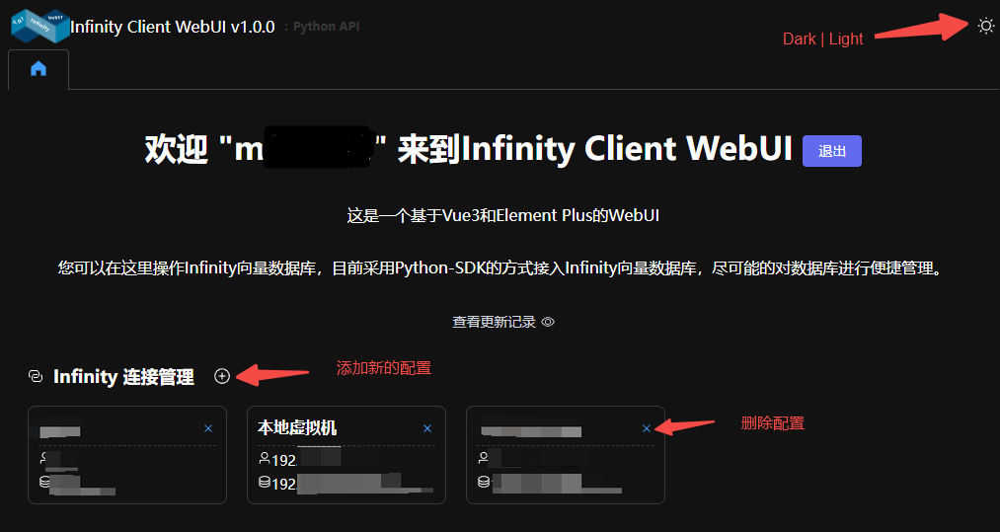
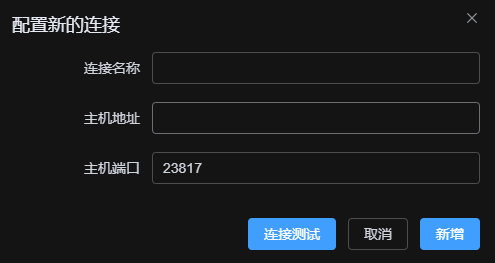
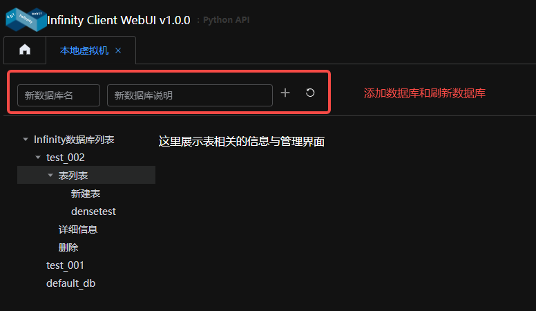
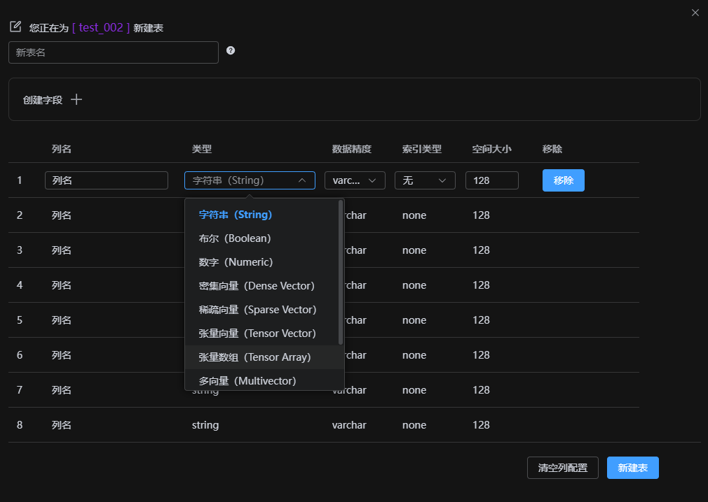
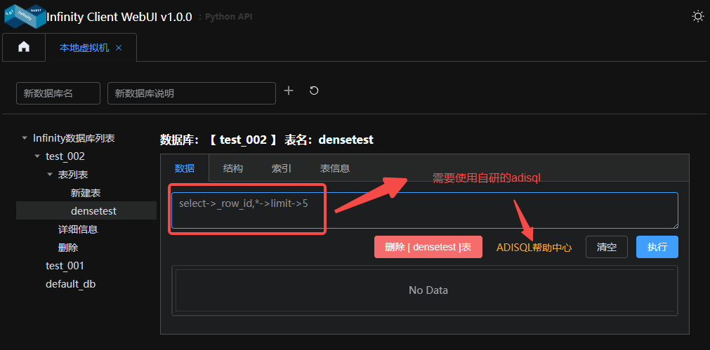

# infinity client WebUI v1.0.0

#### 项目介绍
infinity client WebUI 是一个基于vue3的webUI，用于管理infinity vector数据库。

#### 软件架构
```
底层框架：vue3 + typescript + vite + fastapi + uvicorn + Sqlite3
UI框架：element-plus
python版本：3.11
uv版本：uv 0.6.5
数据库：infinity vector v0.6.0-dev3
nodejs：v22.14.0
npm: 10.9.2
```

#### 安装教程

1.  安装UV
```
pip install uv
```
2.  进入项目目录
```
cd infinity-client
```
3.  安装依赖
```
uv sync
cd web
npm i
npm run build
```
4.  启动项目
```
python main.py
```
5.  打开浏览器访问
```
http://localhost:8000
```

#### 使用说明

1.  本系统是一个多用户系统，每个用户可以创建多个数据库配置，可以同时管理多个数据库，仅支持单机管理，不支持集群管理。
2.  登录注册

3.  主页

4.  数据库配置

5.  数据库管理

6.  新增表

7.  表管理与数据管理


#### 参与贡献

1.  Fork 本仓库
2.  新建 Feat_xxx 分支
3.  提交代码
4.  新建 Pull Request
5. test


